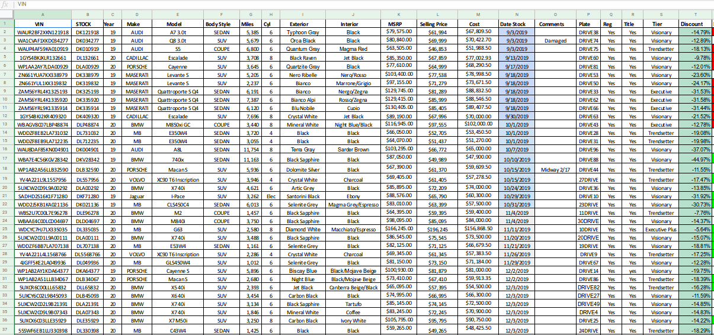

# MVP
Applacation used for competitive pricing in the auto industry 

# Sites that you are compared to each day #
  - cars.com
  - cargurus.com
  - carmax.com
  - autotrader.com
  - more can be added if needed or wanted.
 
### Different Zip Codes we are searching. Most of which are high income area due to the type of inventory presented to me. ### 

|                         |                        |                          |
|-------------------------|------------------------|--------------------------|
| Atherton, CA (94027)    | Los Angeles, CA (90067 | Old Westbury, WA (98039) |
| Potomac, MD (20817)     | Kenilworth, IL (60043) | Indina Hill, OH (45243)  |
| Palms Beach, FL (33480) | Weston, MA (02493)     | Wilmington, DE (19807)   |
| Miami Beach, FL (33109) | Greenwich, CT (02493)  | Charlotte, NC (28207)    |
| Avon, OH (444011)       | Gladwyne, PA (19035)   | Medina, WA (98039)       |
  
Other zipcodes can be added in or changed as needed. 

# Things I would stil need to know # 
  - How does sale tax work when you sell out of state? 
  - How much is shipping a car if someone buys out of state?
  - Is selling out of state supported? 
  
 # Functionality # 
 
 The base program allows you to upload your excel sheet to it and will return three things.
  - All competior prices
  - Suggested best price.
  - Date and time of analysis
 
# Input #

Upload any excel or google sheets file from the computer or drive into the system

# Output # 
[comment]: <> ()

 
 
